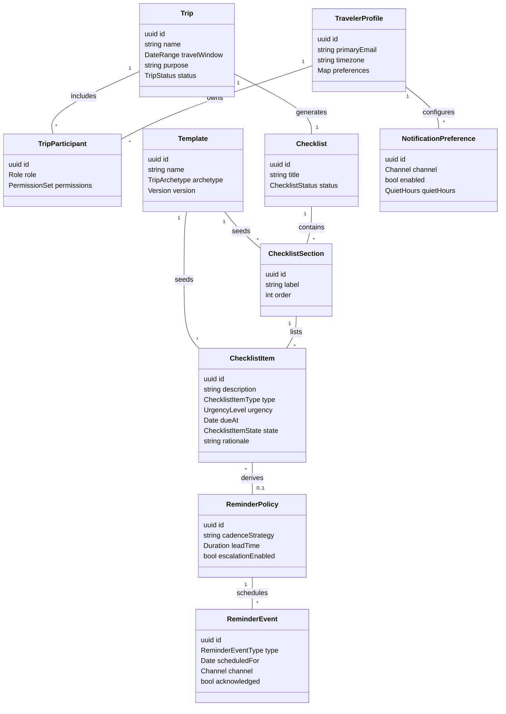
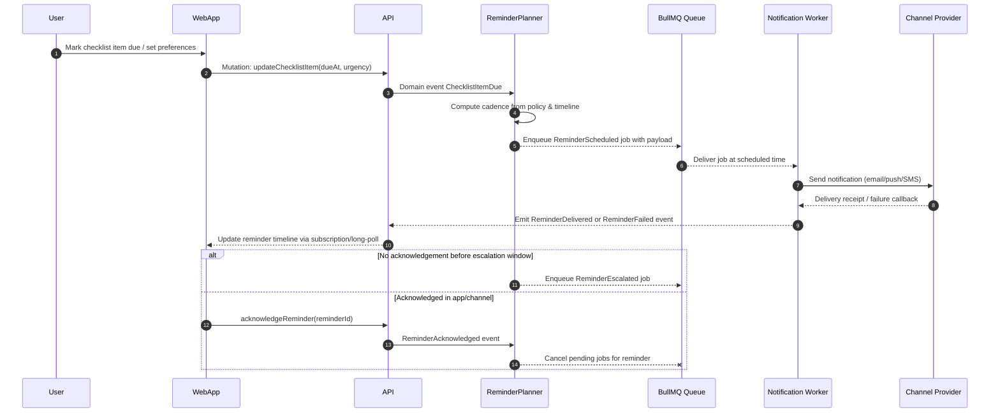

# Architecture Diagrams

## Domain Model Overview

```mermaid
classDiagram
    class TravelerProfile {
        uuid id
        string primaryEmail
        string timezone
        Map preferences
    }
    class Trip {
        uuid id
        string name
        DateRange travelWindow
        string purpose
        TripStatus status
    }
    class TripParticipant {
        uuid id
        Role role
        PermissionSet permissions
    }
    class Checklist {
        uuid id
        string title
        ChecklistStatus status
    }
    class ChecklistSection {
        uuid id
        string label
        int order
    }
    class ChecklistItem {
        uuid id
        string description
        ChecklistItemType type
        UrgencyLevel urgency
        Date dueAt
        ChecklistItemState state
        string rationale
    }
    class ReminderPolicy {
        uuid id
        string cadenceStrategy
        Duration leadTime
        bool escalationEnabled
    }
    class ReminderEvent {
        uuid id
        ReminderEventType type
        Date scheduledFor
        Channel channel
        bool acknowledged
    }
    class Template {
        uuid id
        string name
        TripArchetype archetype
        Version version
    }
    class NotificationPreference {
        uuid id
        Channel channel
        bool enabled
        QuietHours quietHours
    }

    TravelerProfile "1" -- "*" TripParticipant : owns
    Trip "1" -- "*" TripParticipant : includes
    Trip "1" -- "1" Checklist : generates
    Checklist "1" -- "*" ChecklistSection : contains
    ChecklistSection "1" -- "*" ChecklistItem : lists
    ChecklistItem "*" -- "0..1" ReminderPolicy : derives
    ReminderPolicy "1" -- "*" ReminderEvent : schedules
    TravelerProfile "1" -- "*" NotificationPreference : configures
    Template "1" -- "*" ChecklistSection : seeds
    Template "1" -- "*" ChecklistItem : seeds
```

## Reminder Scheduling Flow

```mermaid
sequenceDiagram
    autonumber
    participant User
    participant WebApp
    participant API
    participant ReminderPlanner
    participant Queue as BullMQ Queue
    participant Worker as Notification Worker
    participant Provider as Channel Provider

    User->>WebApp: Mark checklist item due / set preferences
    WebApp->>API: Mutation: updateChecklistItem(dueAt, urgency)
    API->>ReminderPlanner: Domain event ChecklistItemDue
    ReminderPlanner->>ReminderPlanner: Compute cadence from policy & timeline
    ReminderPlanner-->>Queue: Enqueue ReminderScheduled job with payload
    Queue-->>Worker: Deliver job at scheduled time
    Worker->>Provider: Send notification (email/push/SMS)
    Provider-->>Worker: Delivery receipt / failure callback
    Worker-->>API: Emit ReminderDelivered or ReminderFailed event
    API-->>WebApp: Update reminder timeline via subscription/long-poll
    alt No acknowledgement before escalation window
        ReminderPlanner-->>Queue: Enqueue ReminderEscalated job
    else Acknowledged in app/channel
        WebApp->>API: acknowledgeReminder(reminderId)
        API->>ReminderPlanner: ReminderAcknowledged event
        ReminderPlanner--x Queue: Cancel pending jobs for reminder
    end
```
